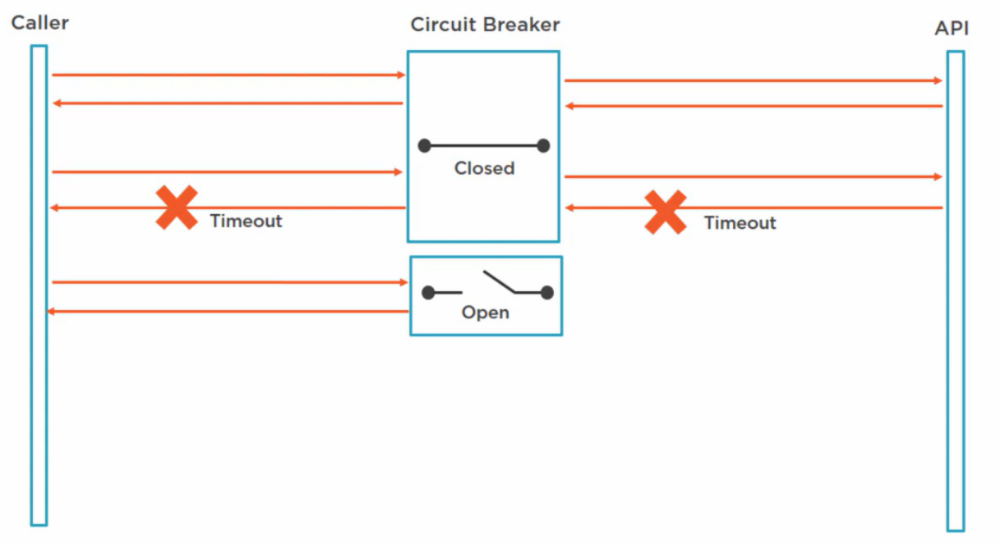

# Circuit Breaker pattern

## Intro

First we need to understand the difference between transient and non-transient failures. 
Transient failure are the ones that are temporary and the system will recover from shortly after for example your connection to the database is down for a moment for whatever reason. 
Non-transient failures are the one that the system cannot recover from on its own for example a remote service is down, to bring up the service and you're left with failed calls wasting system resources.

## Circuit Breaker to the rescue
The idea of the circuit breaker pattern is pretty simple, it abstracts the system to be called, so in our code we don't communicate with the api directly. 

## How it works
assume there's your service and the external api are connected by a switch, 
the switch can be in 3 states opened(no connection), closed(connected), half-open(no sure). 

when the circuit breaker is closed and the application is using it to call the api, the api will be called, if the call succeeds the api will return the result. 

If our app tries to send a request, and the api is busy it could timeout, the circuit breaker will pass the error to the app. 
because the call failed the circuit breaker will switch to the open state. 

Now when it receives a request it will raise a circuit breaker open exception and return to the app without calling the api. 
You can set the mechanism by which the circuit should try to send request again i.e become half-open but usually the circuit breaker waits for some period of time and then it becomes half-open. 

In this state the circuit is not really open, it will allow one call to the api just to test if it works, if the call fails the circuit breaker will switch to the open state. 
If the call succeeds the results will return to the caller as if the circuit was closed, and the circuit breaker switches to the closed state. 

## Notes
The circuit breaker prevents calls that are likely to fail, this way it does not keep making calls to a service that's failing and it does not always has to wait on the timeout to know when the call has failed. 
In a real world scenario you would probably not put the circuit breaker on the open state after just one failure, you might only do that when certain conditions are met, like when the request 5 times within 10 minutes, or when 60% of the calls are failing.... 
You can make the half-open test smarter by checking against the health end point in the remote api.
